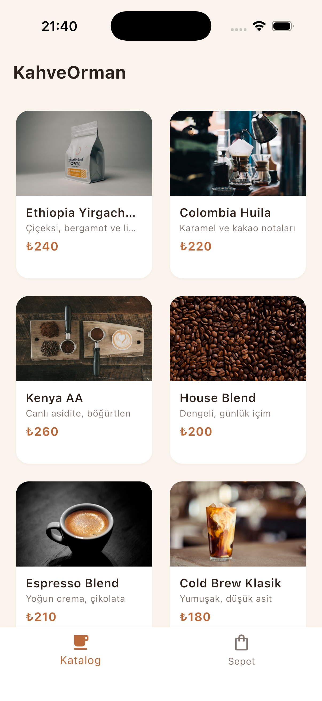
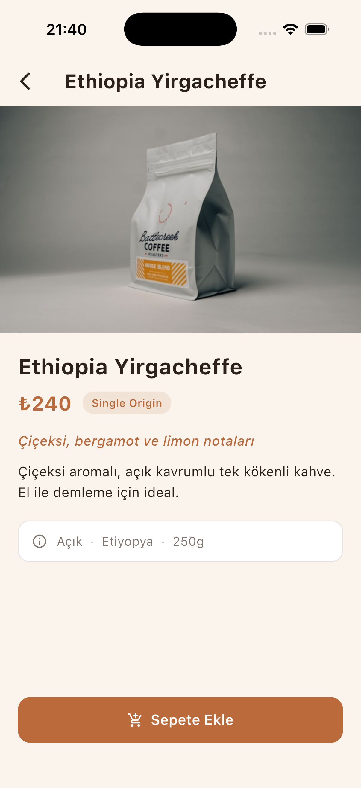
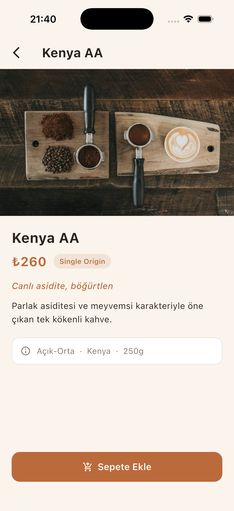
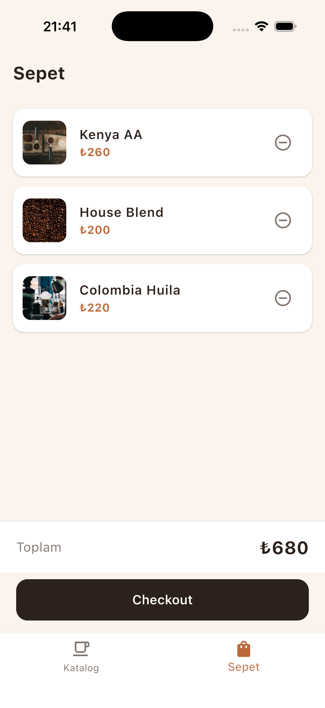
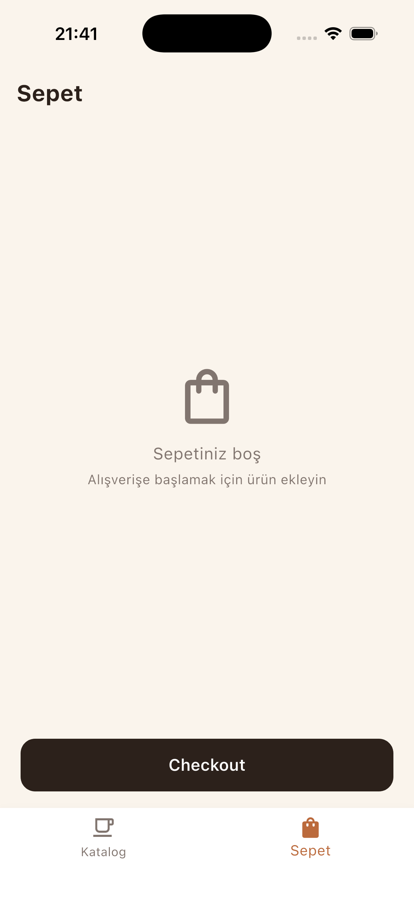
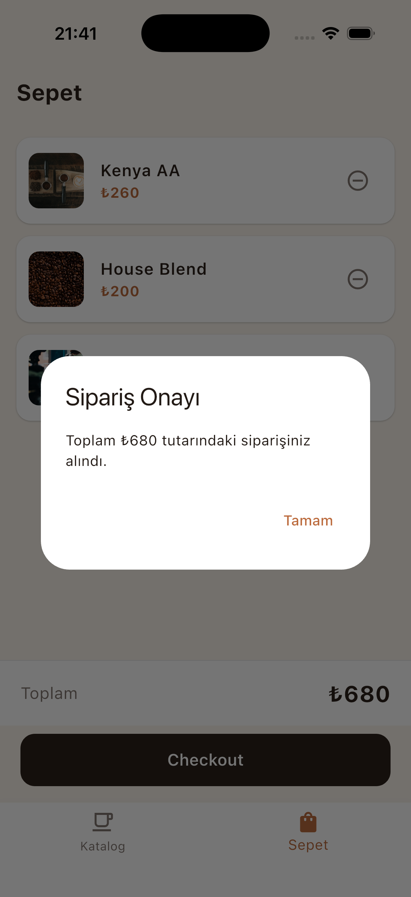

<div align="center">

# ☕ KahveOrman

### Flutter Mini Katalog Uygulaması

*Specialty kahve dükkanı için geliştirilen; ürün listesi, ürün detayı ve sepet akışına sahip mobil katalog uygulaması.*


</div>

---

## 📑 İçindekiler

- [Proje Adı ve Açıklama](#-proje-adı-ve-açıklama)
- [Özellikler](#-özellikler)
- [Ekran Görüntüleri](#-ekran-görüntüleri)
- [Kullanılan Teknolojiler ve Flutter Sürümü](#-kullanılan-teknolojiler-ve-flutter-sürümü)
- [Proje Yapısı](#-proje-yapısı)
- [Kurulum ve Çalıştırma (Kendi Bilgisayarınızda)](#-kurulum-ve-çalıştırma-kendi-bilgisayarınızda)
- [Sık Karşılaşılan Sorunlar](#-sık-karşılaşılan-sorunlar)
- [Eğitsel Kapsam](#-eğitsel-kapsam)
- [Veri Kaynağı Notu](#-veri-kaynağı-notu)
- [Teslim Kriterleri](#-teslim-kriterleri)

---

## 📌 Proje Adı ve Açıklama

**Proje Adı:** KahveOrman

KahveOrman, **specialty kahve** dükkanı için geliştirilmiş bir Flutter **Mini Katalog**
uygulamasıdır. Kullanıcı; ürünleri ızgara (GridView) düzeninde görüntüler, bir ürüne
dokunarak detay sayfasına geçer ve beğendiği ürünleri sepete ekleyip yönetebilir.

Uygulama akışı:

> **Ürün Listesi (GridView)** → **Ürün Detayı (Navigator + veri taşıma)** → **Sepet (setState + ListView.builder + Checkout)**

Uygulama tamamen **`material.dart`** ve Dart'ın dahili kütüphaneleriyle yazılmıştır;
herhangi bir üçüncü parti paket (http, provider, google_fonts vb.) **kullanılmamıştır**.

---

## ✨ Özellikler

| Özellik | Açıklama |
|---|---|
| 🗂️ **Katalog ekranı** | `GridView.builder` ile 2 sütunlu ürün kartları (görsel, ad, kısa açıklama, fiyat) |
| 🔎 **Ürün detayı** | `Navigator.push` ile açılır; ürün verisi constructor üzerinden taşınır |
| 🛒 **Sepet** | `ListView.builder` ile listelenir, **toplam tutar** otomatik hesaplanır |
| ➖ **Sepetten çıkarma** | Her ürün satırında silme butonu (`setState` ile anlık güncelleme) |
| ✅ **Checkout (Sipariş)** | Sipariş onay penceresi ve sepetin temizlenmesi (simülasyon) |
| 🎨 **KahveOrman teması** | Krem/karamel/espresso renk paleti, Material 3 |
| 🖼️ **Güvenli görseller** | `Image.network` + `loadingBuilder` / `errorBuilder` placeholder (kırık görsel yok) |
| 📦 **JSON veri modeli** | `assets/products.json` → `Product.fromJson` / `toJson` |

---

## 📱 Ekran Görüntüleri

<div align="center">

<table>
  <tr>
    <td align="center">
      <br/>
      <sub><b>Katalog (Ürün Listesi)</b></sub>
    </td>
    <td align="center">
      <br/>
      <sub><b>Ürün Detayı</b></sub>
    </td>
    <td align="center">
      <br/>
      <sub><b>Ürün Detayı</b></sub>
    </td>
  </tr>
  <tr>
    <td align="center">
      <br/>
      <sub><b>Sepet (Dolu)</b></sub>
    </td>
    <td align="center">
      <br/>
      <sub><b>Sepet (Boş)</b></sub>
    </td>
    <td align="center">
      <br/>
      <sub><b>Sipariş Onayı (Checkout)</b></sub>
    </td>
  </tr>
</table>

</div>

---

## 🛠️ Kullanılan Teknolojiler ve Flutter Sürümü

| Araç / Teknoloji | Sürüm |
|---|---|
| **Flutter SDK** | **3.44.1** (stable) |
| **Dart SDK** | **3.12.1** |
| **UI Kütüphanesi** | `material.dart` (Material 3, `useMaterial3: true`) |
| **Ek paket** | Yok (yalnızca `material.dart` + `dart:convert` + `flutter/services.dart`) |
| **Hedef platformlar** | Android, iOS |

> Bu proje **Flutter 3.44.1** ile geliştirilmiş ve test edilmiştir. Farklı bir sürümle
> de çalışabilir; ancak birebir aynı davranış için **3.44.1** önerilir.

---

## 🗂️ Proje Yapısı

```
kahveorman-flutter/
├── lib/
│   ├── main.dart                     # Uygulama girişi (MaterialApp + tema)
│   ├── theme.dart                    # KahveOrman renk teması (ThemeData)
│   ├── models/
│   │   └── product.dart              # Product modeli (fromJson / toJson)
│   ├── data/
│   │   └── product_repository.dart   # products.json okur → List<Product>
│   ├── screens/
│   │   ├── home_page.dart            # BottomNavigationBar + SEPET STATE
│   │   ├── catalog_screen.dart       # GridView ürün listesi
│   │   ├── detail_screen.dart        # Navigator ile açılan ürün detayı
│   │   └── cart_screen.dart          # Sepet + silme + Checkout
│   └── widgets/
│       └── product_card.dart         # Tek ürün kartı
├── assets/
│   ├── products.json                 # Ürün verisi (JSON)
│   └── images/                       # README ekran görüntüleri
├── pubspec.yaml
└── README.md
```

---

## 🚀 Kurulum ve Çalıştırma (Kendi Bilgisayarınızda)

Aşağıdaki adımlar, projeyi **sıfırdan kendi bilgisayarınızda** çalıştırmak içindir.

### 1) Önkoşullar

Uygulamayı çalıştırmadan önce aşağıdakiler kurulu olmalıdır:

| Gereksinim | Açıklama |
|---|---|
| **Flutter SDK 3.44.1** | Kurulum: <https://docs.flutter.dev/get-started/install> |
| **Dart SDK** | Flutter ile birlikte gelir, ayrıca kurmaya gerek yok |
| **Android Studio** | Android emülatörü ve Android SDK için |
| **Xcode** *(yalnızca macOS)* | iOS simülatörü için |
| **Git** | Repoyu klonlamak için |
| **VS Code** *(opsiyonel)* | Geliştirme ortamı |

### 2) Projeyi Klonlayın

```bash
git clone https://github.com/<kullanici-adi>/kahveorman-flutter.git
cd kahveorman-flutter
```

### 3) Flutter Kurulumunu Doğrulayın

```bash
flutter --version     # Flutter 3.44.1 görmelisiniz
flutter doctor        # Eksik araç var mı kontrol eder (✓ olmalı)
```

> `flutter doctor` çıktısında Android toolchain ve/veya Xcode satırlarının **[✓]**
> olması gerekir. Eksik varsa, çıktının önerdiği komutlarla tamamlayın.

### 4) Bağımlılıkları Yükleyin

```bash
flutter pub get
```

### 5) Bir Cihaz / Emülatör Başlatın

Uygulamanın çalışması için **açık (booted) bir emülatör veya bağlı bir fiziksel cihaz** gerekir.

**Android:**
```bash
flutter emulators                       # mevcut emülatörleri listeler
flutter emulators --launch <emulator_id>   # örn: Pixel_9
```
> Alternatif: Android Studio → **Device Manager** → bir emülatörü ▶ ile başlatın.

**iOS (yalnızca macOS):**
```bash
open -a Simulator
```

Bağlı cihazları kontrol etmek için:
```bash
flutter devices
```

### 6) Uygulamayı Çalıştırın

```bash
flutter run
```

Birden fazla cihaz bağlıysa, hedefi belirtin:

```bash
flutter run -d <device_id>     # örn: flutter run -d "iPhone 17"
```

İlk derleme birkaç dakika sürebilir. Uygulama açıldıktan sonra çalışan terminalde
**`r`** ile hot reload, **`R`** ile hot restart yapabilirsiniz.

> **Web'de denemek isterseniz (opsiyonel):** Bu proje Android + iOS için
> yapılandırılmıştır. Web desteği eklemek için:
> ```bash
> flutter create --platforms=web .
> flutter run -d chrome
> ```

---

## 🧯 Sık Karşılaşılan Sorunlar

| Sorun | Çözüm |
|---|---|
| `No supported devices connected` | Bir emülatör başlatın (Adım 5) veya fiziksel cihaz bağlayın. |
| `No devices found` | `flutter emulators --launch ...` ile emülatörü **boot** edin, sonra `flutter run`. |
| Görseller yüklenmiyor | Görseller internetten (`Image.network`) çekilir; **internet bağlantısı** gerekir. Yüklenmezse otomatik kahve ikonu placeholder gösterilir. |
| Yanlış Flutter sürümü | `flutter --version` ile kontrol edin; 3.44.1 önerilir. |

---

## 🎓 Eğitsel Kapsam

Bu proje, eğitim yönergesindeki temel Flutter konularının tamamını kapsar:

| Konu | Uygulandığı Yer |
|---|---|
| Stateless / Stateful widget | Tüm ekranlar (`home_page.dart` stateful) |
| **GridView** ile kart tabanlı tasarım | `catalog_screen.dart` |
| **Navigator** (sayfa geçişi) | Katalog → Detay (`Navigator.push`) |
| **Route Arguments** (veri taşıma) | `DetailScreen(product: ...)` constructor |
| **JSON + fromJson/toJson** | `models/product.dart`, `data/product_repository.dart` |
| **ListView.builder** | `cart_screen.dart` |
| **Asset yönetimi** | `assets/products.json` (`pubspec.yaml`) |
| **Basit state güncelleme** (`setState`) | Sepete ekleme / çıkarma / checkout |
| Temel UI teması | `theme.dart` |

---

## 🗃️ Veri Kaynağı Notu

Ürün verisi `assets/products.json` dosyasından okunur (yerel asset, ağ isteği yoktur).
Ürün görselleri eğitim/demo amacıyla Unsplash kahve fotoğraflarıdır. Bu veriler gerçek
bir e-ticaret altyapısını temsil etmez; yalnızca veri modelleme ve listeleme mantığını
göstermek amacıyla kullanılmıştır.

---

## ✅ Teslim Kriterleri

| Kriter | Durum |
|---|---|
| Public GitHub repository | ✔️ |
| Proje çalışır durumda | ✔️ |
| `README.md` mevcut | ✔️ |
| Proje adı | ✔️ KahveOrman |
| Kısa açıklama | ✔️ |
| Kullanılan Flutter sürümü | ✔️ 3.44.1 |
| Çalıştırma adımları | ✔️ |
| Ekran görüntüleri | ✔️ (6 ekran) |

---

<div align="center">
<sub>KahveOrman · Flutter Mini Katalog · Eğitim amaçlı geliştirilmiştir.</sub>
</div>
